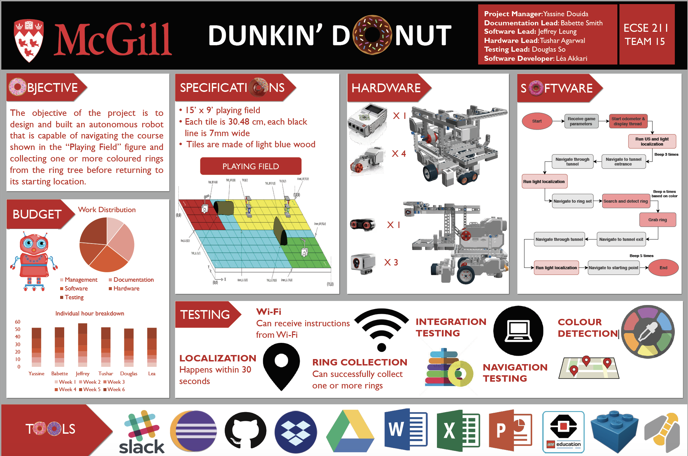
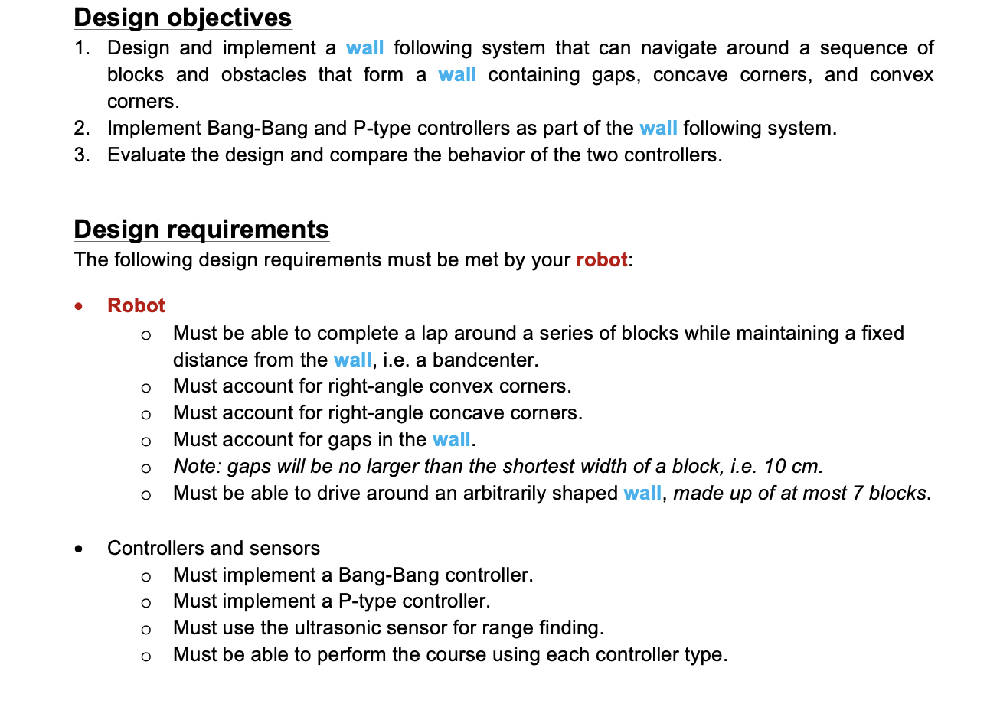
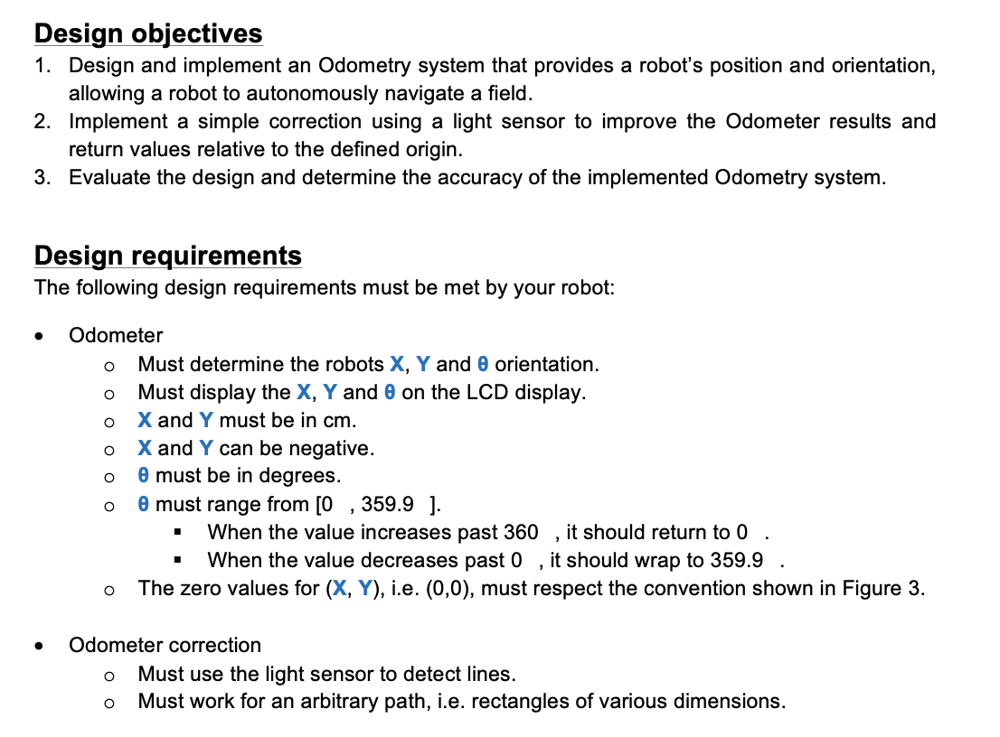
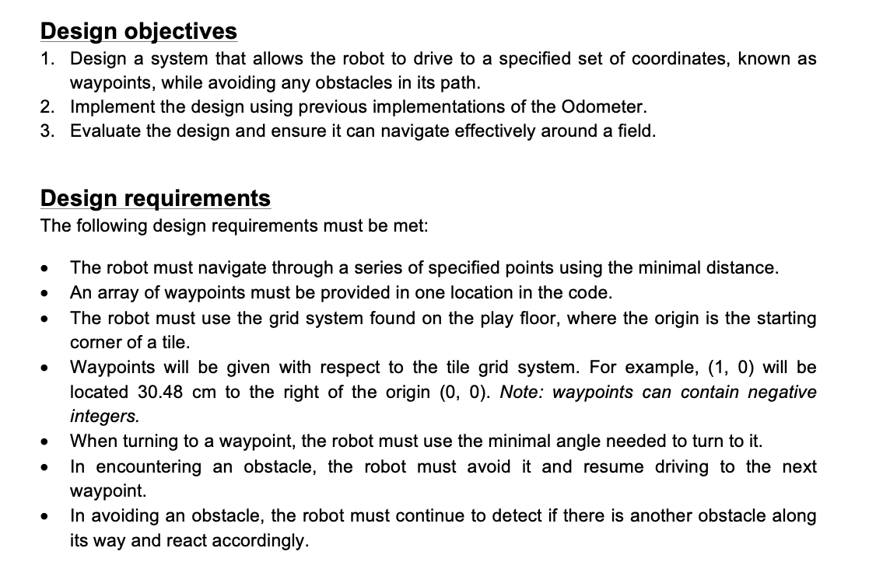
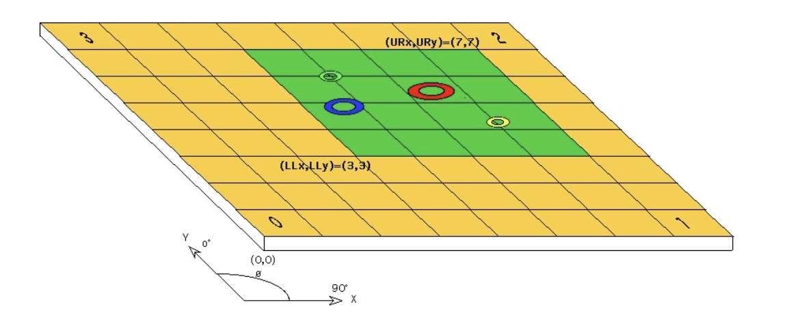
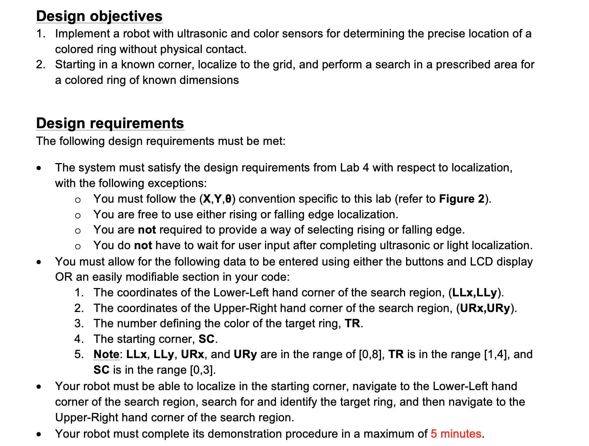
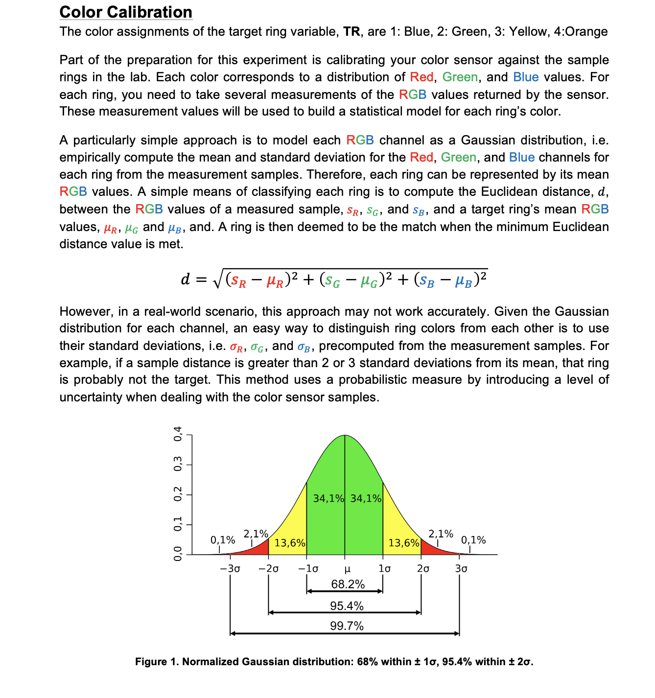
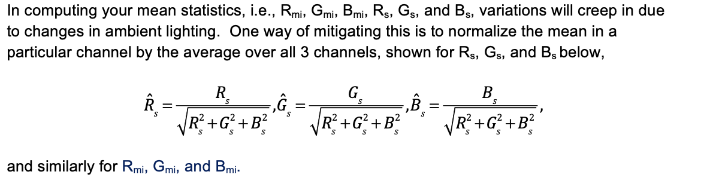

# Design Principle and Methods

## About the Design Project: 

 The goal of this project is to design and construct a machine that can autonomously navigate a closed course in search of a set of colored rings. Once found, the machine must determine how to grasp and retrieve as many rings as possible, taking into account the value of each ring asdepicted by its color. In order to count, a ring must be returned to the starting corner. 

---

## Final Project Poster:

---

# About the Labs:

## Lab 1 : Wall Following

---

## Lab 2 : Odometry

---

## Lab 3 : Navigation & Obstacle Avoidance

---

## Lab 4 : Localization

---

## Lab 5 : Search & Localize

